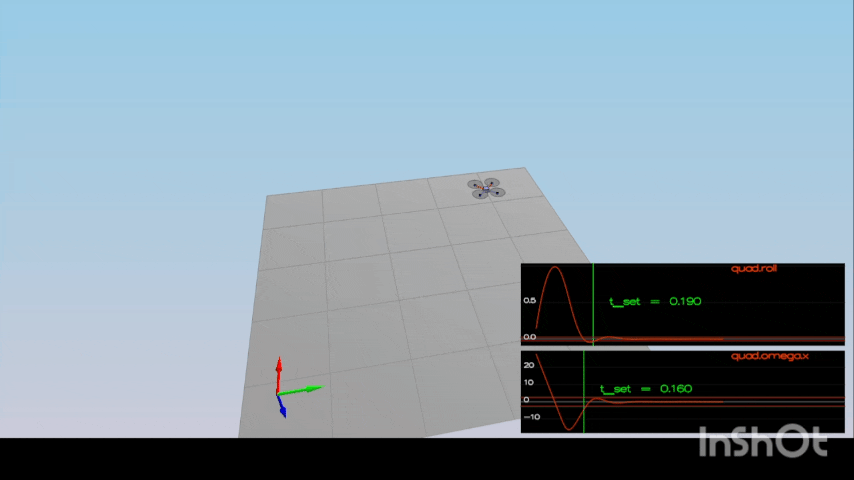

#### Project FCND – Implementation of Controller for Quadcopter – Writeup

Overview
In this project, I implemented a full cascaded controller for a quadrotor UAV in C++. The controller includes body-rate control, attitude control, position and velocity control, altitude control with integral action, yaw control, and trajectory tracking. The controller was validated through five simulation scenarios, each designed to test a specific aspect of control performance and robustness.
All scenarios (1–5) were successfully completed.

### Scenario 1: Intro / Basic Stability
Objective:
Verify that the quadrotor can remain stable and hover without diverging.
Implementation:
No new controller logic was required for this scenario. This scenario was used to confirm:
  •	Correct motor mixing
  •	Proper thrust direction
  •	Correct sign conventions
Code Location
•	GenerateMotorCommands()
Converts collective thrust and body moments into individual motor thrusts using quad geometry.
Result
The quad remained stable and did not diverge, confirming the correctness of the motor command mapping.

### Scenario 2: Body Rate and Roll/Pitch Control
Objective
Stabilize angular rates and bring the vehicle back to level attitude when initialized with a nonzero roll rate.
Implementation
Body Rate Control
Implemented a proportional body-rate controller that computes desired moments from rate error and moments of inertia.
Code:
•	Function: BodyRateControl()
•	Location: QuadControl.cpp
Key logic:
  // Rate error
  V3F rateError = pqrCmd - pqr
  // Element-wise proportional term
  V3F uBar = kpPQR * rateError;   // kpPQR is a V3F (Kp_p, Kp_q, Kp_r)
  // Convert desired angular accelerations to moments using moments of inertia
  momentCmd.x = Ixx * uBar.x;
  momentCmd.y = Iyy * uBar.y;
  momentCmd.z = Izz * uBar.z;

Roll/Pitch Control
Implemented a controller that converts desired lateral acceleration into desired roll and pitch rates using the rotation matrix.
Code:
•	Function: RollPitchControl()
Tuning
•	kpPQR = [52, 52, 5]
•	kpBank = 14
Result
•	Roll rate converged to zero
•	Vehicle stabilized without excessive overshoot

Figure 2 shows the quadrotor initialized with a nonzero roll rate.  
The body rate controller drives the roll rate to zero and stabilizes the attitude.

### Scenario 3: Position, Velocity, and Yaw Control
Objective
Move two quadrotors to target positions with different yaw initial conditions.
Implementation
Lateral Position Control
Implemented a PD controller on position and velocity, including velocity and acceleration limits.
Code:
•	Function: LateralPositionControl()
Key logic:
// Position error
  V3F posErr = posCmd - pos;
  // Velocity error
  V3F velErr = velCmd2 - vel;
// Acceleration command (add to feed-forward)
  accelCmd += kpVelXY * velErr;

Altitude Control
Implemented a vertical PD + integral controller with feedforward acceleration.
Code:
•	Function: AltitudeControl()
Key logic:
// Integrate altitude error
  integratedAltitudeError += zErr * dt;
// Desired vertical acceleration in NED
  float u1Bar = kpPosZ * zErr + kpVelZ * zDotErr + KiPosZ * integratedAltitudeError + accelZCmd;
// Thrust must counter gravity: accel down positive in NED, so (g - u1Bar)
  float thrust = mass * (static_cast<float>(CONST_GRAVITY) - u1Bar)
      / fmaxf(R(2, 2), 1e-3f);

Yaw Control
Implemented proportional yaw control with angle wrapping.
Code:
•	Function: YawControl()
Tuning
•	kpPosXY = 2.2
•	kpVelXY = 9
•	kpYaw = 1.6
Result
Both quadrotors converged to their target positions. The yaw-controlled quad aligned correctly without destabilizing position tracking.

### Scenario 4: Non-Idealities and Robustness
Objective
Ensure the controller works under non-ideal conditions:
•	Shifted center of mass
•	Increased vehicle mass
Implementation
Integral Altitude Control
Added integral action in altitude control to compensate for steady-state errors due to mass mismatch.
Code:
•	AltitudeControl()
•	Integral term: integratedAltitudeError
To improve robustness, lateral aggressiveness was reduced by limiting speed, acceleration, and tilt.
Key Design Decisions
•	Relaxed lateral limits to prevent saturation
•	Increased altitude position gain to compensate for thrust loss during tilt
•	Maintained damping to avoid oscillations
Final Tuning (Scenario 4)
kpPosZ = 39
KiPosZ = 20
kpVelZ = 14

maxSpeedXY = 3
maxHorizAccel = 8
maxTiltAngle = 0.42

Result
All three quadrotors successfully followed the commanded motion despite non-ideal dynamics.

### Scenario 5: Trajectory Tracking
Objective
Track a figure-eight trajectory using the full cascaded controller.
Implementation
No new control logic was required. The existing controller was used with relaxed lateral limits to allow higher-speed maneuvering.
Key Changes
•	Increased allowable speed, acceleration, and tilt
•	Maintained stable attitude and rate control
Result
Both quadrotors successfully tracked the figure-eight trajectory and remained within the required position error bounds.

Conclusion
A full cascaded quadrotor controller was successfully implemented and tuned in C++. Each control layer was validated incrementally through targeted simulation scenarios. The final controller demonstrates stable hover, precise attitude control, accurate position tracking, robustness to non-idealities, and successful trajectory following.

